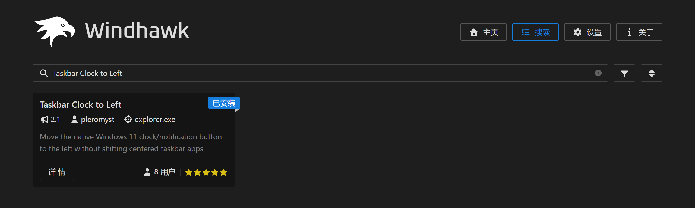

# Pleromyst's Windhawk Mods

A collection of Windhawk mods created and maintained by me.

These mods are published through the official Windhawk mod repository.

## Mods

### Taskbar Clock to Left

Move the native Windows 11 clock/notification button to the left without shifting centered taskbar apps.

- ✅ Available in the official Windhawk Mod Store
- Source code: [`mod/taskbar-clock-to-left.wh.cpp`](mod/taskbar-clock-to-left.wh.cpp)

## Repository Relationship

This repository is the main home for my personal Windhawk mods.

I also maintain a fork of the official Windhawk mod repository for submitting my mods and updates upstream through pull requests.

- Personal mod repository: **pleromyst/pleromyst-windhawk-mods**
- My Windhawk fork: [pleromyst/windhawk-mods](https://github.com/pleromyst/windhawk-mods)
- Official Windhawk repository: [ramensoftware/windhawk-mods](https://github.com/ramensoftware/windhawk-mods)

Development and documentation are maintained here. Versions intended for official Windhawk distribution are synchronized to my fork and submitted to the official repository through pull requests.

---

## 中文说明

这里存放我自己制作和维护的 Windhawk MOD。

本仓库是我的个人 Windhawk MOD 作品仓库，用于保存源码、说明以及后续作品。

我的 `windhawk-mods` Fork 则主要用于向 Windhawk 官方仓库提交 Pull Request。

### 当前作品

- **Taskbar Clock to Left**
  - 将 Windows 11 原生时钟/通知按钮移动到任务栏左侧
  - 不影响居中的任务栏应用图标
  - ✅ 已收录至 Windhawk 官方 MOD 商店
  

  
